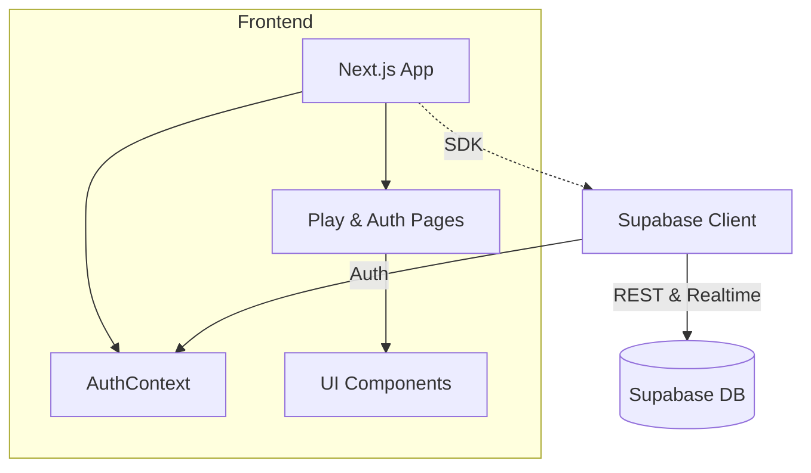

<div align="center">
  <a href="https://shipwrecked.hackclub.com/?t=ghrm" target="_blank">
    
  </a>
</div>


# swordle-client

A Wordle-inspired game client built with Next.js, Supabase, and Tailwind CSS.

## Overview

swordle-client is a modern web application that brings the popular Wordle game experience to the browser. It’s built with the Next.js App Router (v15.4.1) and TypeScript, styled using Tailwind CSS, and leverages Supabase for user authentication and data persistence . The app features a responsive design powered by shadcn/ui and Radix UI components, supports light/dark themes via next-themes, and provides a simple yet engaging gameplay interface.

## Architecture



## Features

- Wordle-like gameplay with configurable word length and guess limit 
- User authentication (sign up, login, logout) powered by Supabase Auth 
- Responsive UI built with Tailwind CSS and shadcn/ui components
- Light/dark theme support via next-themes
- Real-time feedback on guesses and keyboard state
- Clean, modular codebase using the Next.js App Router

## Installation

```bash

```

## Configuration

Create a .env.local file in the project root with the following variables to connect to your Supabase project :

```bash

```

## Usage

Once the development server is running, open http://localhost:3000 in your browser. You can navigate through:

- /auth/signup – Create a new account
- /auth/login – Sign in to your account
- /play – Start playing the Wordle-inspired game

## Contributing

Contributions are welcome! To get started:

- Fork the repository
- Create a new branch (`git checkout -b feature/your-feature`)
- Make your changes and commit (`git commit -m "feat: your feature"`)
- Push to your branch (`git push origin feature/your-feature`)
- Open a Pull Request for review

## Acknowledgements

- Next.js – React framework for production
- Supabase – Backend-as-a-Service providing Auth and database
- Tailwind CSS – Utility-first CSS framework
- shadcn/ui & Radix UI – Accessible component library
- Lucide React – Icon library
- Sonner – Notification system
