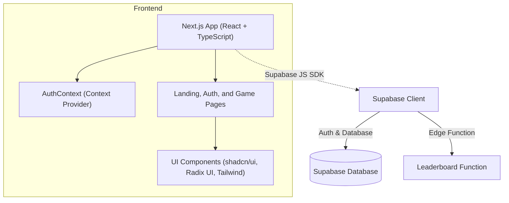

# Swordle

Wordle-inspired SAT vocabulary practice built with Next.js and Supabase.

## Overview

Swordle is a web-based, Wordle-inspired game that challenges players with SAT-level vocabulary. It offers solo games, daily challenges, and multiplayer modes, all backed by Supabase for authentication and data persistence. The app is built with Next.js (v15.4.1), TypeScript, and styled using Tailwind CSS and shadcn/ui components, providing a responsive and engaging user experience.  

## Architecture



The frontend handles routing and UI, while Supabase provides backend services including authentication, database operations, and edge functions.

## Features

- Wordle-style gameplay with 6 guesses and SAT-level words defined by part of speech and definition 
- User authentication (sign up, login, logout) via Supabase Auth 
- Persistent game state and stats tracking (wins, losses, streaks)
- Daily challenges and solo/multiplayer game modes
- Leaderboard powered by a Supabase Edge Function 
- Responsive design with Tailwind CSS, shadcn/ui, and Radix UI
- Light/dark theme support via next-themes
- Clean, modular codebase using the Next.js App Router

## Installation

```bash
git clone https://github.com/dantewins/swordle.git
cd swordle
npm install
```

## Configuration

Create a .env.local file in the project root and add the following variables to connect to your Supabase project:

```bash
NEXT_PUBLIC_SUPABASE_URL=your-supabase-url
NEXT_PUBLIC_SUPABASE_ANON_KEY=your-public-anon-key
```

## Usage

- Start the development server: npm run dev
- Open http://localhost:3000 in your browser
- Navigate to /auth/signup to create a new account
- Go to /auth/login to sign in
- Click "Play" on the landing page to choose a game mode 
- Play your game at /play/[gameId] using on-screen or keyboard input

## Contributing

- Fork the repository
- Create a branch for your feature or fix: git checkout -b feature/your-feature
- Commit your changes: git commit -m "feat: description"
- Push to your branch: git push origin feature/your-feature
- Open a Pull Request for review

## Acknowledgements

- Next.js – React framework for production 
- Supabase – Backend-as-a-Service for Auth and database
- Tailwind CSS – Utility-first CSS framework 
- shadcn/ui & Radix UI – Accessible component libraries
- Lucide React – Icon library
- Sonner – Notification system
