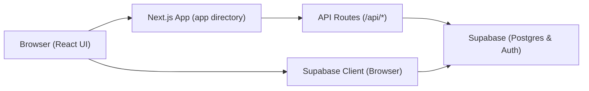

<div align="center">
  <a href="https://shipwrecked.hackclub.com/?t=ghrm" target="_blank">
    
  </a>
</div>

# Swordle.

A Wordle-inspired game for mastering SAT vocabulary, featuring solo practice, daily challenges, and real-time multiplayer.

## Overview

Swordle challenges players to guess SAT-level vocabulary words within six attempts, providing Wordle-style feedback (green for correct, yellow for present, gray for absent) along with word definitions and parts of speech. Built with Next.js, TypeScript, and Tailwind CSS on the frontend, and powered by Supabase for authentication, database, and realtime updates, Swordle offers engaging solo practice, future daily challenges, and competitive real-time multiplayer modes.

## Architecture



## Features

- Wordle-style guessing with SAT-level vocabulary, definitions, and parts of speech
- Solo practice mode for random word challenges
- Real-time multiplayer mode with matchmaking queue and presence detection
- Daily challenge mode (planned) with a shared puzzle each day
- User authentication and session management via Supabase Auth
- Persistent game state, stats tracking (wins, losses, streaks), and leaderboards
- Responsive UI built with Tailwind CSS, shadcn/ui, and Radix UI components
- Realtime updates powered by Supabase Realtime and presence channels
- Celebratory confetti effects on wins and rich notifications with Sonner

## Installation

```bash
git clone https://github.com/dantewins/swordle.git
cd swordle
npm install

```

## Configuration

Create a `.env.local` file in the project root with your Supabase credentials:

```bash
NEXT_PUBLIC_SUPABASE_URL=your-supabase-url
NEXT_PUBLIC_SUPABASE_ANON_KEY=your-public-anon-key
SUPABASE_SERVICE_ROLE_KEY=your-service-role-key

```

## Usage

- Run the development server: `npm run dev`
- Open http://localhost:3000 in your browser
- Sign up or log in via `/auth/login` and `/auth/signup`
- Click “Play” to select a game mode and start guessing
- For multiplayer: enter the matchmaking queue and wait for an opponent
- Visit `/play/<gameId>` to resume or spectate games

## Contributing

Contributions are welcome! To contribute:

- Fork the repository and create your branch: `git checkout -b feature/YourFeature`
- Install dependencies and run the development server locally
- Ensure your changes include relevant tests and documentation
- Commit your changes with descriptive messages
- Push to your branch and open a pull request

## Acknowledgements

- Next.js – React framework for production
- Supabase – Backend-as-a-Service for auth, database, and realtime
- Tailwind CSS – Utility-first styling
- shadcn/ui & Radix UI – Accessible React component libraries
- Lucide React – Icon library
- Sonner – Notification system
- canvas-confetti – Celebration effects
- Framer Motion – Animation library
